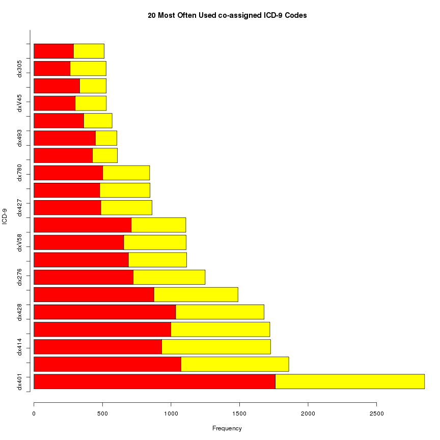

R code to do the same data transformation
========================================================

This takes really a long time because it changes cell values one at a time (yep!) -

##STAGE 5: Simplify the data


```r
rm(list = ls())
setwd("~/ProfPeek")
# setwd('F:\\Prof_Peek\\Validation')
source("install_load.R")
install_load("plyr", "stringr", "knitr", "Hmisc", "maptools", "RColorBrewer", 
    "classInt")

load("dcdata_all.Rda")
# add a unique sequence ID
dcdata_all$order <- seq(nrow(dcdata_all))
# keep admission years 2009-2011 only.. & also those who has assigned
# community (if commarea is unknown, we can't use the data for study)
dcdata_validation0911 <- dcdata_all[dcdata_all$wrongyear != 1 & !is.na(dcdata_all$wrongyear) & 
    !is.na(dcdata_all$area_numbe), ]

# simplify the data
vector <- dcdata_validation0911[, c("order", "dx0", "dx1", "dx2", "dx3", "dx4", 
    "dx5", "dx6", "dx7", "dx8", "dx9", "dx10")]

# now - we need to remove all decimal digits BEFORE - head(vector) order dx0
# dx1 dx2 dx3 dx4 dx5 dx6 dx7 dx8 dx9 dx10 1 1 724.5 780.2 427.32 805.4
# 807.2 426.53 780.79 272.4 788.29 244.9 600.01 2 2 780.79 410.71 486 255.41
# 710.0 492.8 427.31 458.9 733.00 <NA> <NA> AFTER - tail(vector) dx0 dx1 dx2
# dx3 dx4 dx5 dx6 dx7 dx8 dx9 dx10 88692 V22 648 250 648 285 644 664 V58 V27
# <NA> <NA>

# there is one weird value we want to get rid of - cause trouble later it's
# in row.names='4409' and in column='dx0' head(vector[c('4409'),c('dx0')])
# [1] 'c(\'789.00\', \'789.00\')'
vector[c("4409"), c("dx0")] <- "0"

# remove decimal digits
for (i in 1:11) {
    counter <- i - 1
    exp <- paste0("dx", counter)
    vector[, c(exp)] <- gsub("[.][0-9]+$", "", vector[, c(exp)])
}
# create a list of DX code - first copy from the first col, 'dx0'
dxlist <- vector[, c("dx0")]
# keep adding more DX code as it appears on the rest of columns
for (i in 2:11) {
    counter <- i - 1
    exp <- paste0("dx", counter)
    # below will put all cleaned-codes in one long vector
    dxlist <- c(dxlist, vector[, c(exp)])
}
dxlist <- dxlist[!duplicated(dxlist)]
dxlist <- sort(dxlist)
newvec <- vector

##### takes loooooooong time to proces the following part
##### ######################################## skip the first one, '0', because
##### it's a dummy/made-up dx code I used to replace weird/wrong code for (i in
##### 175:175){ #run just for dx250 for (i in 2:length(dxlist)){
##### dx<-as.character(dxlist[i]) dxcol<-paste0('dx',dx) newvec[,c(dxcol)]<-'F'
##### for (k in 1:11){ counter<-k-1 exp<-paste0('dx',counter)
##### obsdx<-as.character(newvec[,c(exp)]) for (j in 1:length(obsdx)){
##### newvec[j,c(dxcol)]<-ifelse(obsdx[j]==dx | newvec[j,c(dxcol)]=='T','T','')
##### } } } # data checking #View(newvec[newvec$dx008=='T' &
##### !is.na(newvec$dx008),]) # check data using this count(newvec[,c('dx008')])
##### count(newvec[,c('dx250')]) # convert all - I mean ALL - Null (NA) to
##### 'empty)' newvec[(newvec)==''] <-'0' # don't remember why it was necessary,
##### make note when remembering newvec[is.na(newvec)]<-'0' # remove the
##### original/source DX0-DX10 variables (dx0, dx1, .. dx10) #
##### newvec<-newvec[,-c(1:11)] save(newvec, file='associationrules.Rda')
##### write.table(newvec, file='associationrules.csv', sep=',', row.names=FALSE,
##### na='NULL')

##### extra stuff
##### ##########################################################################

# count the DX code occurrence:
dxlist <- vector[, c("dx0")]
# keep adding more DX code as it appears on the rest of columns
for (i in 2:11) {
    counter <- i - 1
    exp <- paste0("dx", counter)
    # below will put all cleaned-codes in one long vector
    dxlist <- c(dxlist, vector[, c(exp)])
}
dxlist <- sort(dxlist)
dxlist_freq <- data.frame(table(dxlist))
temp <- dxlist_freq[order(-dxlist_freq$Freq), ]
temp <- temp[temp$Freq > 1000 & temp$dxlist != 250, ]
# what's the most often associated DX code for a diabetes patient?
head(temp)
```

```
##     dxlist Freq
## 321    401 9891
## 201    276 8541
## 342    428 7694
## 991    V30 6742
## 654    780 6662
## 660    786 6357
```

```r

load("associationrules_orig072214.Rda")
# convert all - I mean ALL - Null (NA) to 'empty)'
newvec <- newvec[, -c(1:11)]
newvec[(newvec) == "TRUE"] <- "1"
newvec[(newvec) == "FALSE"] <- "0"
newvec[is.na(newvec)] <- "0"

# vname<-names(newvec[1]) newvec2<-newvec[,1] names(newvec2)[1]<-vname
for (i in 1:ncol(newvec)) {
    vname <- names(newvec[i])
    newvec[, c(vname)] <- as.numeric(newvec[, i])
}
count(newvec[, c("dx008")])
```

```
##   x  freq
## 1 0 10076
## 2 1   144
```

```r

sex <- dcdata_validation0911[, c("order", "sex")]
newvec_sex <- merge(newvec, sex, by.x = c("row.names"), by.y = c("row.names"), 
    all.x = TRUE)
newvec_sex <- newvec_sex[, -c(1, 798)]  # remove 'Row.names' and 'order' columns
dxfreq <- aggregate(newvec_sex[, c(1:796)], by = list(newvec_sex$sex), FUN = sum, 
    na.rm = T)  #exclude 'sex' column
# transpose for graphing
dxfreq2 <- data.frame(t(dxfreq[, -1]))
colnames(dxfreq2) <- dxfreq[, 1]
dxfreq2[, c("total")] <- dxfreq2[, 1] + dxfreq2[, 2]
temp <- dxfreq2[order(-dxfreq2$total), ]
temp <- temp[-c(1), ]  # we know dx250 is the most frequent one..
temp <- temp[, -c(3)]  # remove total..
temp <- temp[1:20, ]
barplot(t(temp), horiz = TRUE, col = heat.colors(2), main = "20 Most Often Used co-assigned ICD-9 Codes", 
    ylab = "ICD-9", xlab = "Frequency")
axis(2, at = seq(0, 100), labels = FALSE)
legend(6, 30, names(temp), cex = 0.8, fill = heat.colors(2))
```

 


